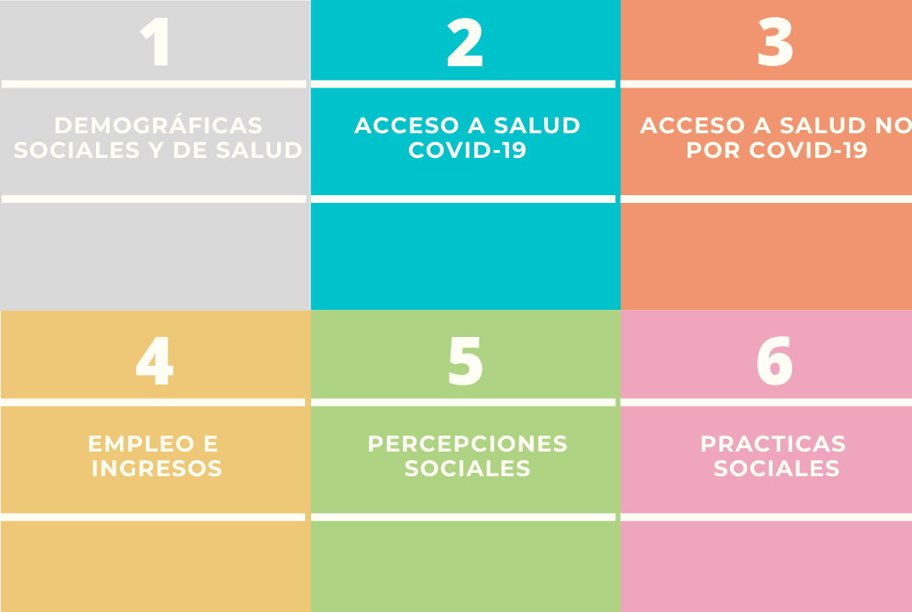

```{r setup, include=FALSE}
knitr::opts_chunk$set(echo = FALSE)
```

# Presentación

MOVID-IMPACT es una encuesta transversal representativa[^1] sobre el impacto de la pandemia COVID-19 en Chile (MOVID-Impact)realizada por el proyecto académico CoV-IMPACT-C (*ANID n°960*)

Se puede acceder a más información haciendo click [aquí](https://movid-impact.netlify.app/)

[^1]: A nivel nacional urbano

## Diseño muestral

- La **población objetivo** de la encuesta es la población mayor de 18 años residente en viviendas particulares de la zona urbana del país
- El **diseño muestral** es probabilístico y estratificado según área geográfica y tamaño poblacional
- El tamaño muestral es 2.142 hogares y 1.261 entrevistados.

## Módulos



## Módulos

- Módulo A: Registro del entrevistado y su hogar
- Módulo B:Otras variables demográficas
- Módulo C:Preexistencias
- Módulo D:Acceso a Salud Covid-19
- Módulo E:Acceso a Salud NoCovid-19
- Módulo F:Acceso Social de la Pandemia
- Módulo G:Empleo
- Módulo V: Vacuna Covid-19

# MOVID-IMPACT-2

**Situación de MOVID-IMPACT-1 de cara a MOVID-IMPACT-2**
- Escazo uso de la base de datos
  - Solo han sido utilizado variables de vacuna y respeto a normas de cuidado
  
- Problemas de validez 
  - Preguntas que no se entienden
  - Actualización de los datos (última versión entregada por Centro UC)
  
# Nuevas encuestas

- **International Social Survey Programm**, Health and Health Insurance.

- **Encuesta Social COVID-19**

- **Encuesta Bienestar Social**

## **International Social Survey Programm**, Health and Health Insurance.

- Percepción sobre el sistema de salud
   - Eficiencia
   - Necesidad de cambios
   - Financiamiento (pago de impuestos, servicios)
   - Satisfacción
- Percepción de justicia en el sistema de salud
  - Derecho a la salud entre ricos y pobres
  - Percepción de acceso
- Condiciones de Acceso al sistema de Salud
  - Dificultades para el acceso
  - Medicina alternativa vs medicina convencional
  - Cobertura del sistema de salud
- Rol del gobierno en la entrega de beneficios básicos
- Controles 
  - Crónicos o incapacitados físicos

## Encuesta Social COVID-19

- Realizada en julio y noviembre 2020

- Cuidados y empleo
  - ¿Cuáles son las principales razones de porqué no buscó trabajo? (ie04)
  - ¿Que tendría que ocurrir para que busque trabajo durante las próximas cuatro semanas? (ie06)
- Impacto económico
  - Reducción de gastos en distintas dimensiones (permite controlar)
  - En caso de salud: gastos medicamentos, consultas médicas, exámenes, cirugías, otros.
  - Razones no económicas
- Beneficios sociales
  - del Estado
  - gobiernos locales
  - Organizaciones sociales/ vecinales
