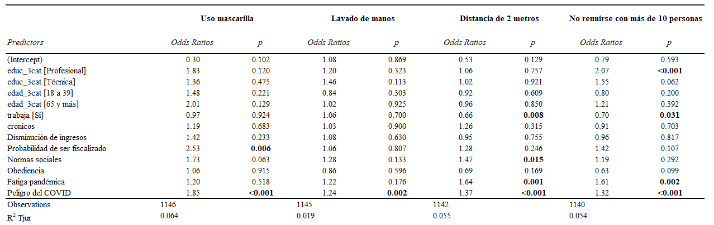

```{r setup, include=FALSE}
knitr::opts_chunk$set(echo = FALSE, message = F, warning = F, results = 'asis')
summarytools::st_options(bootstrap.css     = FALSE,       # Already part of the theme so no need for it
           plain.ascii       = FALSE,       # One of the essential settings
           style             = "rmarkdown", # Idem.
           dfSummary.silent  = TRUE,        # Suppresses messages about temporary files
           footnote          = NA,          # Keeping the results minimalistic
           subtitle.emphasis = FALSE)       # For the vignette theme, this gives better results.
#summarytools::st_css()

library(ggplot2); theme_set(theme_classic() + theme(text = element_text(size = 12)))
library(knitr);  options(knitr.kable.NA = 'No sabe/No responde')

kable <- function(data) {
  knitr::kable(data, booktabs = T, digits = 3) %>% kable_styling(latex_options = c("striped", "scale_down"), bootstrap_options = c("center", "striped", "hover", "responsive", "condensed"))
}
```

```{r packages, echo = F}
# 1. Cargar paquetes
pacman::p_load(tidyverse, kableExtra, ggsci)
# 2. Cargar tablas
movid_i <- readRDS("../../output/data/movid_i.RDS")
```
----

# Presentación

El presente informe ha sido elaborado en base a MOVID-IMPACT, una encuesta transversal probabilística aplicada a un total de 1.261 personas. 


Tiene por objetivo analizar las **barreras sociales, económicas y culturales** que se imponen para el cuidado durante la pandemia por COVID-19 en Chile. Para ello se considerarán los siguientes aspectos

## ¿Quiénes se cuidan y quiénes no?

Para abordar quiénes se cuidan y de qué forma, hemos medido en el **grado** y la **percepción** del cumplimiento de medidas de autocuidado.


### Grado de cumplimiento de medidas de autocuidado

Las acciones emprendidas para protegerse del coronavirus se consulta por la frecuencia en la realización de: 

  - Lavarse las manos durante 20 segundos

  - Mantener al menos dos metros de distancia de personas a su alrededor

  - Evitar reunirse con más de 10 personas en un espacio cerrado

  - Usar mascarilla al salir de su hogar

  - Usar mascarilla al reunirse con otras personas en un lugar cerrado
  
En el Gráfico 1 podemos ver la distribución de quiénes tienen un alto grado de cumplimiento de estas medidas (contestan "Siempre" y "Casi siempre")

**Tabla 1**. Grado de cumplimiento general de medidas de autocuidado

```{r , echo = F, results='asis'}
movid_i %>% group_by(comp) %>% 
    summarise(n = n(), percent = 100 * n() / nrow(movid_i)) %>%
  mutate(comp = if_else(comp == 1, "Alto grado", "Bajo grado")) %>% 
  knitr::kable(digits = 1, row.names = F,  booktabs = T,
             col.names = c("Cumplimiento","n", "%"))
```


**Tabla 2.** Estadísticos descriptivos del grado de cumplimiento de medidas de autocuidado según características sociodemográficas

```{r, echo = F, results='asis'}
movid_i %>%
  filter(!is.na(comp)) %>%
  mutate(comp = if_else(comp == 1, "Alto grado", "Bajo grado")) %>% 
  select(comp,sexo, edad_3cat, educ_3cat, trabaja, cronicos, prev_2categ) %>% pivot_longer(!comp, names_to = "variable", values_to = "value") %>% 
  group_by(variable,value, comp)  %>% 
  summarise(n = n()) %>% 
  mutate (prop = round(n/ sum(n),4)*100) %>%
  na.omit() %>% 
  knitr::kable(digits = 2, row.names = F,  booktabs = T,
             col.names = c("Variable","Subgrupo", "Cumplimiento", "n", "%")) %>%
  collapse_rows(columns = 1:2)  %>%  
  pack_rows("Cronicos", 1, 4) %>%
            pack_rows("Edad", 5, 10) %>%
            pack_rows("Nivel educacional", 11, 16) %>%
            pack_rows("Previsión", 17, 21) %>%
            pack_rows("Sexo", 22, 25)  %>%
            pack_rows("Trabaja", 26, 29)   
```

### Percepcion de que cumplimiento de medidas de cuidado

A los participantes se les consultó su **percepción** sobre el grado de cumplimiento de estas medidas de **su familia cercana y él/ella**. Las medidas mencionadas son quedarse en casa, usar mascarilla, mantener distanciamiento social o lavarse las manos. 

**Tabla 3**. Percepción del grado de cumplimiento general de medidas de autocuidado
```{r, echo = F, results='asis'}
movid_i %>% group_by(cumple_normas) %>% 
    summarise(n = n(), percent = 100 * n() / nrow(movid_i)) %>%
  na.omit() %>%
  mutate(cumple_normas = if_else(cumple_normas == 1, "Alto grado", "Bajo grado")) %>% 
  knitr::kable(digits = 2, row.names = F,  booktabs = T,
             col.names = c("Percepción cumplimiento", "n", "%")) 
```

**Gráfico 1**. Percepción del grado de cumplimiento de medidas de cuidado
```{r normas, echo = F}
movid_i %>% group_by(normas) %>% 
  summarise(n = n()) %>% 
  mutate (prop = round(n/ sum(n),4)*100) %>% na.omit() %>%  
  ggplot(aes(x = normas, y = prop, fill = normas)) +
  geom_bar(stat = "identity") +
  geom_text(aes(label = paste0(prop, "%")),
            position = position_stack(vjust = .5), color="white", size= 4, fontface = "bold") + 
  labs(x = "", y = "%", title = "")  + 
  theme_classic() + scale_fill_jama(name = "") + guides(fill = F)

```

## Fatiga pandémica


### Mantenerse informado sobre el COVID-19

- Me informo constantemente sobre los avances del coronavirus y sus efectos en Chile

**Gráfico 2**. Mantenerse informado
```{r inform, echo = F}
movid_i %>% group_by(f5_2) %>% 
  summarise(n = n()) %>% 
  mutate (prop = round(n/ sum(n),4)*100) %>% na.omit() %>%  
  ggplot(aes(x = f5_2, y = prop, fill = f5_2)) +
  geom_bar(stat = "identity") +
  geom_text(aes(label = paste0(prop, "%")),
            position = position_stack(vjust = .5), color="white", size= 4, fontface = "bold") + 
  labs(x = "", y = "%", title = "")  + 
  theme_classic() + scale_fill_jama(name = "") + guides(fill = F)

```

**Gráfico 3**. Mantenerse informado por tramo etario
```{r inform-byage, echo = F}
movid_i %>% group_by(edad_3cat,f5_2) %>% 
  summarise(n = n()) %>% 
  mutate (prop = round(n/ sum(n),4)*100) %>% na.omit() %>%  
  ggplot(aes(x = edad_3cat, y = prop, fill = f5_2)) +
  geom_bar(stat = "identity") +
  geom_text(aes(label = paste0(prop, "%")),
            position = position_stack(vjust = .5), color="white", size= 4, fontface = "bold") + 
  labs(x = "", y = "%", title = "")  + 
  theme_classic() + scale_fill_jama(name = "")

```

### Desmotivación por seguir medidas de cuidado

- *A medida que ha avanzado la crisis sanitaria, me siento cada vez más desmotivado para seguir las medidas de protección recomendadas*

**Gráfico 4**. Sentir desmotivación para el cumplimiento de medidas de cuidado
```{r desmotivate, echo = F}
movid_i %>% group_by(f5_3) %>% 
  summarise(n = n()) %>% 
  mutate (prop = round(n/ sum(n),4)*100) %>% na.omit() %>%  
  ggplot(aes(x = f5_3, y = prop, fill = f5_3)) +
  geom_bar(stat = "identity") +
  geom_text(aes(label = paste0(prop, "%")),
            position = position_stack(vjust = .5), color="white", size= 4, fontface = "bold") + 
  labs(x = "", y = "%", title = "")  + 
  theme_classic() + scale_fill_jama(name = "") + guides(fill = F)

```

**Gráfico 5**. Sentir desmotivación para el cumplimiento de medidas de cuidado por tramo etario
```{r desmotive-age, echo = F}
movid_i %>% group_by(edad_3cat,f5_3) %>% 
  summarise(n = n()) %>% 
  mutate (prop = round(n/ sum(n),4)*100) %>% na.omit() %>%  
  ggplot(aes(x = edad_3cat, y = prop, fill = f5_3)) +
  geom_bar(stat = "identity") +
  geom_text(aes(label = paste0(prop, "%")),
            position = position_stack(vjust = .5), color="white", size= 4, fontface = "bold") + 
  labs(x = "", y = "%", title = "")  + 
  theme_classic() + scale_fill_jama(name = "")

```


- *Resulta cada vez más difícil seguir las medidas de protección sin que esto afecte de manera negativa mi vida*

**Gráfico 6**. Percibir que medidas de cuidado tienen impacto negativo
```{r negative, echo = F}
movid_i %>% group_by(f5_4) %>% 
  summarise(n = n()) %>% 
  mutate (prop = round(n/ sum(n),4)*100) %>% na.omit() %>%  
  ggplot(aes(x = f5_4, y = prop, fill = f5_4)) +
  geom_bar(stat = "identity") +
  geom_text(aes(label = paste0(prop, "%")),
            position = position_stack(vjust = .5), color="white", size= 4, fontface = "bold") + 
  labs(x = "", y = "%", title = "")  + 
  theme_classic() + scale_fill_jama(name = "") + guides(fill = F)

```

**Gráfico 7**. Percibir que medidas de cuidado tienen impacto negativo según si trabaja o no remuneradamente

```{r negative-age, echo = F}
movid_i %>% group_by(trabaja,f5_4) %>% 
  summarise(n = n()) %>% 
  mutate (prop = round(n/ sum(n),4)*100) %>% na.omit() %>%  
  ggplot(aes(x = trabaja, y = prop, fill = f5_4)) +
  geom_bar(stat = "identity") +
  geom_text(aes(label = paste0(prop, "%")),
            position = position_stack(vjust = .5), color="white", size= 4, fontface = "bold") + 
  labs(x = "", y = "%", title = "")  + 
  theme_classic() + scale_fill_jama(name = "")

```


## Fiscalización


- *En Chile, si una persona sale sin permiso durante una cuarentena es muy poco probable que sea controlado y multado*

**Gráfico 8**. Percepción del cumplimiento de las medidas de control sanitario
```{r legal, echo = F}
movid_i %>% group_by(f5_5) %>% 
  summarise(n = n()) %>% 
  mutate (prop = round(n/ sum(n),4)*100) %>% na.omit() %>%  
  ggplot(aes(x = f5_5, y = prop, fill = f5_5)) +
  geom_bar(stat = "identity") +
  geom_text(aes(label = paste0(prop, "%")),
            position = position_stack(vjust = .5), color="white", size= 4, fontface = "bold") + 
  labs(x = "", y = "%", title = "")  + 
  theme_classic() + scale_fill_jama(name = "") + guides(fill = F)

```

**Gráfico 9**. Percepción del cumplimiento de la población sobre las medidas de control sanitario según su **grado de cumplimiento** de medidas

```{r legal-age, echo = F}
movid_i %>% group_by(comp,f5_5) %>% 
  summarise(n = n()) %>%
  mutate(comp = if_else(comp == 1, "Alto grado", "Bajo grado")) %>% 
  mutate (prop = round(n/ sum(n),4)*100) %>% na.omit() %>%  
  ggplot(aes(x = comp, y = prop, fill = f5_5)) +
  geom_bar(stat = "identity") +
  geom_text(aes(label = paste0(prop, "%")),
            position = position_stack(vjust = .5), color="white", size= 4, fontface = "bold") + 
  labs(x = "", y = "%", title = "")  + 
  theme_classic() + scale_fill_jama(name = "")

```


## Lack income

### Para la población en general

- *Considerando el total de ingresos recibidos por su hogar el mes pasado, ¿usted diría que el ingreso de su hogar en noviembre de 2020 comparado con la situación en noviembre de 2019…? (g49)*

**Gráfico 10**. Percepción de reducción de ingresos en general
```{r lackincome, echo = F}
movid_i %>% group_by(g49) %>% 
  summarise(n = n()) %>% 
  mutate (prop = round(n/ sum(n),4)*100) %>% na.omit() %>%  
  ggplot(aes(x = g49, y = prop, fill = g49)) +
  geom_bar(stat = "identity") +
  geom_text(aes(label = paste0(prop, "%")),
            position = position_stack(vjust = .5), color="white", size= 4, fontface = "bold") + 
  labs(x = "", y = "%", title = "")  + 
  theme_classic() + scale_fill_jama(name = "") + guides(fill = F)

```

**Gráfico 11**. Percepción de reducción de ingresos en general

```{r lackincome-work, echo = F}
movid_i %>% group_by(trabaja,g49) %>% 
  summarise(n = n()) %>% 
  mutate (prop = round(n/ sum(n),4)*100) %>% na.omit() %>%  
  ggplot(aes(x = trabaja, y = prop, fill = g49)) +
  geom_bar(stat = "identity") +
  geom_text(aes(label = paste0(prop, "%")),
            position = position_stack(vjust = .5), color="white", size= 4, fontface = "bold") + 
  labs(x = "", y = "%", title = "")  + 
  theme_classic() + scale_fill_jama(name = "")

```

### Para empresarios y empleadores

- *Desde el inicio de la pandemia, ¿los ingresos por ventas de su empresa o negocio…?*

**Gráfico 12**. Percepción de reducción de ingresos para quienes tienen empresas
```{r g18, echo = F}
movid_i %>% group_by(g18) %>% 
  summarise(n = n()) %>% 
  mutate (prop = round(n/ sum(n),4)*100) %>% na.omit() %>%  
  ggplot(aes(x = g18, y = prop, fill = g18)) +
  geom_bar(stat = "identity") +
  geom_text(aes(label = paste0(prop, "%")),
            position = position_stack(vjust = .5), color="white", size= 4, fontface = "bold") + 
  labs(x = "", y = "%", title = "")  + 
  theme_classic() + scale_fill_jama(name = "") + guides(fill = F)

```

- *¿Ha recibido ayuda de alguna iniciativa comunitaria?*

**Gráfico 13**. Percepción de reducción de ingresos en general

```{r communitary, echo = F}
movid_i %>% group_by(f4_3) %>% 
  summarise(n = n()) %>% 
  mutate (prop = round(n/ sum(n),4)*100) %>% na.omit() %>%  
  ggplot(aes(x = f4_3, y = prop, fill = f4_3)) +
  geom_bar(stat = "identity") +
  geom_text(aes(label = paste0(prop, "%")),
            position = position_stack(vjust = .5), color="white", size= 4, fontface = "bold") + 
  labs(x = "", y = "%", title = "")  + 
  theme_classic() + scale_fill_jama(name = "")

```


# Modelo



# Recomendaciones 
